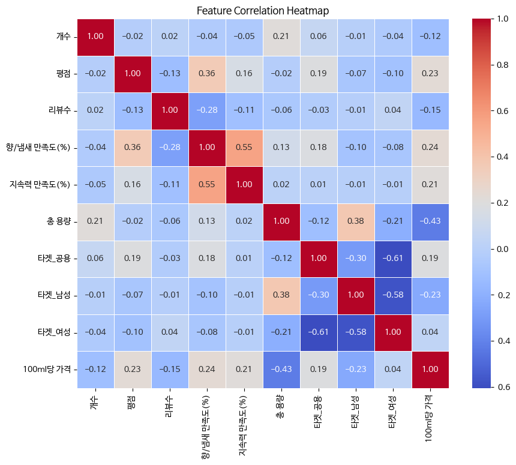
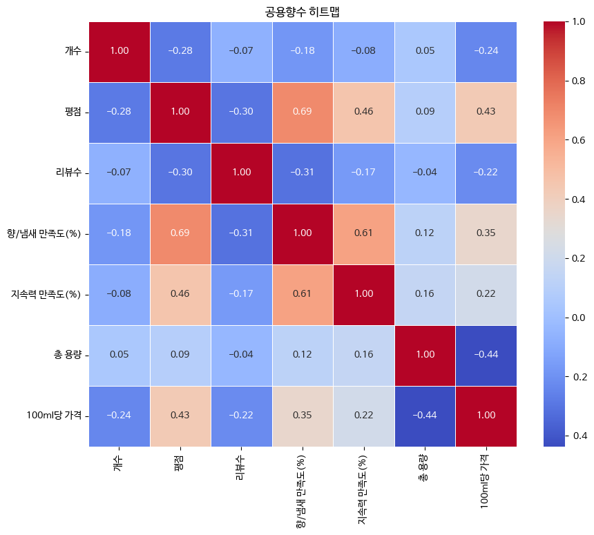

# Mini-PROJECT

* 본 프로젝트는 머신러닝 및 딥러닝을 이용하여 향수에 대한 가격을 예측하는 모델을 만드는 프로젝트입니다.

<details open>
<summary><b>목차</b></summary>

<a id="a-1" href="#b-1">1</a>. 기획<br>
 <a id="a-1.1" href="#b-1.1">1.1</a>. 주제선정<br> <a id="a-2" href="#b-2">2</a>. 데이터 수집<br>
 <a id="a-2.1" href="#b-2.1">2.1</a>. 수집과정<br> <a id="a-3" href="#b-3">3</a>. 학습<br>
 <a id="a-3.1" href="#b-3.1">3.1</a>. 전처리<br>
 <a id="a-3.2" href="#b-3.2">3.2</a>. 머신러닝, 딥러닝<br>
 <a id="a-3.3" href="#b-3.3">3.3</a>. 2차 전처리 및 학습<br>
 <a id="a-4" href="#b-4">4</a>. 프로젝트 결과<br>
 <a id="a-4.1" href="#b-4.1">4.1</a>. 결과<br>

</details>

---

<details open>
<summary><h2><a id="b-1" href="#a-1">1</a>. 기획</h2></summary>

<details open>
<summary><h3><a id="b-1.1" href="#a-1.1">1.1</a>. 주제선정</h3></summary>

* 주제 선정 기준

  * 다른 사람들이 시도하지 않은 학습 데이터
  * API를 이용하여 수집 가능한 방대한 데이터

머신러닝과 딥러닝으로 두 개의 모델을 만들고 두 모델을 비교하기 쉽도록 가격예측과 관련된 주제를 선정하고자 하였습니다.

위 선정기준에 적합한 주제를 찾기 위해 네이버 API를 찾아보았고, 아래와 같은 문서를 발견하였습니다.<br>
[네이버 쇼핑 API](https://developers.naver.com/docs/serviceapi/search/shopping/shopping.md#%EC%87%BC%ED%95%91)

본 프로젝트는 네이버 검색(쇼핑) API를 이용하여 향수에 대한 데이터를 수집하고 이를 이용하여 값을 예측하는 시스템입니다.

</details>
</details>

<details open>
<summary><h2><a id="b-2" href="#a-2">2</a>. 데이터 수집</h2></summary>

<details open>
<summary><h3><a id="b-2.1" href="#a-2.1">2.1</a>. 수집과정</h3></summary>

네이버 API를 이용하여 아래와 같은 응답을 받을 수 있었습니다.

```json
{
    "lastBuildDate": "Thu, 12 Jun 2025 23:20:23 +0900",
    "total": 2313084,
    "start": 1,
    "display": 3,
    "items": [
        {
            "title": "르라보 어나더 13 오 드 퍼품 우디머스크향, 15ml, 1개",
            "link": "https://search.shopping.naver.com/catalog/52269766629",
            "image": "https://shopping-phinf.pstatic.net/main_5226976/52269766629.20250106164959.jpg",
            "lprice": "116280",
            "hprice": "",
            "mallName": "네이버",
            "productId": "52269766629",
            "productType": "1",
            "brand": "르라보",
            "maker": "",
            "category1": "화장품/미용",
            "category2": "향수",
            "category3": "여성향수",
            "category4": ""
        },
        {
            "title": "[국내백화점] 딥디크 플레르드뽀 오드<b>퍼퓸</b> 75ml",
            "link": "https://smartstore.naver.com/main/products/6650856033",
            "image": "https://shopping-phinf.pstatic.net/main_8419535/84195356355.6.jpg",
            "lprice": "177500",
            "hprice": "",
            "mallName": "빈앤코",
            "productId": "84195356355",
            "productType": "2",
            "brand": "딥티크",
            "maker": "씨씨아이알앤디",
            "category1": "화장품/미용",
            "category2": "향수",
            "category3": "남녀공용향수",
            "category4": ""
        },
        {
            "title": "디올뷰티 미스디올 블루밍부케 오 드 뚜왈렛 플로럴향, 30ml, 1개",
            "link": "https://search.shopping.naver.com/catalog/53015074228",
            "image": "https://shopping-phinf.pstatic.net/main_5301507/53015074228.20250214101454.jpg",
            "lprice": "74840",
            "hprice": "",
            "mallName": "네이버",
            "productId": "53015074228",
            "productType": "1",
            "brand": "디올뷰티",
            "maker": "DIOR",
            "category1": "화장품/미용",
            "category2": "향수",
            "category3": "여성향수",
            "category4": ""
        }
    ]
}
```

이를 이용하여 아래 데이터를 수집이 가능했습니다.
* 상품의 고유 ID
* 상품명
* 가격
* 개수
* 용량
* 타겟 (예: 여성용, 남성용, 공용)
* 쇼핑몰 링크

아래는 데이터 수집에 사용한 코드입니다.

<details>
<summary><strong>수집코드1</strong></summary>

```python
import requests
from config import Config
import pandas as pd
import numpy as np
import re


def calculate(ml, price, cnt):
    "(100미리리터 당 가격) / 상품갯수로 리턴"
    cal_ml = round(ml / 100, 5)
    return round((price / cal_ml) / cnt, 2)


np_item_li = []
# 네이버 검색(쇼핑몰) API

# 검색어 및 API URL
query = "향수"

# 요청 헤더
headers = {
    # 애플리케이션 등록 시 발급받은 ID와 Secret
    "X-Naver-Client-Id": Config.NAVER_CLIENT_ID,
    "X-Naver-Client-Secret": Config.NAVER_CLIENT_SECRET
}

start = 1
while_bool = True

try:

    while while_bool:

        url = f"https://openapi.naver.com/v1/search/shop.json?query={query}&display=10&start={start}&sort=sim&exclude=used:cbshop:rental"

        # 요청 전송
        response = requests.get(url, headers=headers)
        data_dict = response.json()


        # 응답 가공
        item_li = data_dict['items']

        for item in item_li:

            if not item['link'].startswith('https://smartstore.naver.com/main/products/'):
                continue

            if item['category2'] != '향수':
                continue

            if item['category3'] == '고체향수':
                continue

            if item['category3'] == '여성향수':
                item['category3'] = '여성'
            elif item['category3'] == '남성향수':
                item['category3'] = '남성'
            elif item['category3'] == '남녀공용향수':
                item['category3'] = '공용'
            else:
                continue


            ml = None

            title = item['title']

            match = re.search(r'(\d+)\s*[mM][lL]', title)
            
            if match:
                ml = int(match.group(1))
                # 매치된 부분을 제거 (중간에 있어도 됨)
                title = title[:match.start()] + title[match.end():]

            if ml == None:
                continue
            
            item['ml'] = int(ml)


            count = 1
            # 1. 수량 추출 (1차 시도: ~개 또는 ~ + ~ 개)
            count_match = re.search(r'(\d+)(\s*\+\s*\d+)?\s*개', title)
            if count_match:
                if count_match.group(2):  # 2 + 3 개
                    numbers = re.findall(r'\d+', count_match.group(0))
                    count = sum(map(int, numbers))
                else:
                    count = int(count_match.group(1))
                title = title[:count_match.start()] + title[count_match.end():]

            else:
                # 2. 수량 추출 (2차 시도: ~ + ~ 형식만 존재하고 '개'는 없음)
                plus_match = re.search(r'(\d+)\s*\+\s*(\d+)', title)
                if plus_match:
                    count = int(plus_match.group(1)) + int(plus_match.group(2))
                    title = title[:plus_match.start()] + title[plus_match.end():]

            item['count'] = count

            title = title.replace('<b>', '')
            title = title.replace('</b>', '')

            title = title.strip()
            title = title.rstrip(' ,')

            while title.find('[') != -1 and title.find(']') != -1:
                if title.find(']') + 1 == len(title):
                    title = title[0:title.find('[')]
                else:
                    title = title[0:title.find('[')] + title[title.find(']')+1:]

            item['lprice'] = int(item['lprice'])


            print(f'{len(np_item_li)+1}번 상품추가')
            print(item)

            np_item_li.append([item['productId'], title, item['lprice'], item['count'], item['ml'], item['category3'], item['link']])

            if len(np_item_li) == 500:
                while_bool = False
                break
        start += 10

except KeyError:
    print('키에러 발생')
    print('더 불러올 상품 없음.')

np_item_li = np.array(np_item_li)
print(np_item_li)

# 1. NumPy 배열을 DataFrame으로 변환
df = pd.DataFrame(np_item_li)

# (선택) 열 이름 지정하고 싶을 경우
df.columns = ['productId', '제목', '가격', '개수', '용량(ml)', '타겟', 'URL'] # 가격은 100ml 당 가격으로 가공할 예정

# 2. CSV 파일로 저장
df.to_csv('data1.csv', index=False, encoding='utf-8-sig')

```
</details>

해당 코드를 이용하여 아래의 표와 같은 데이터를 1차로 수집할 수 있었습니다.
| productId   | 제목              | 가격     | 개수 | 용량(ml) | 타겟 | URL                                                          |
| ----------- | --------------- | ------ | -- | ------ | -- | ------------------------------------------------------------ |
| 84195356355 | 딥디크 플레르드뽀 오드퍼퓸  | 178000 | 1  | 75     | 공용 | [링크](https://smartstore.naver.com/main/products/6650856033)  |
| 82243246039 | 떼시스 블랑쉬 니치향수... | 10000  | 1  | 30     | 여성 | [링크](https://smartstore.naver.com/main/products/4698725205)  |
| 83879217159 | 딥디크 오르페옹 오드퍼퓸   | 181000 | 1  | 75     | 공용 | [링크](https://smartstore.naver.com/main/products/6334714670)  |
| 89243673097 | 디올 소바쥬 오 드 퍼퓸   | 122800 | 1  | 100    | 남성 | [링크](https://smartstore.naver.com/main/products/11699162630) |


다음은 위에서 저장한 data1.csv 파일을 토대로 상품의 링크를 이용하여 크롤링을 진행하여 추가적인 데이터를 수집한 내용입니다.
네이버쇼핑 API를 이용하여 얻는 링크는 동적페이지로 구성이 되어 있어, beatifulsoup라이브러리를 이용하여 데이터 수집이 불가능했습니다.
다양한 시도 끝에 selenium 라이브러리를 이용하여 추가적인 데이터를 수집하여 저장이 가능했습니다.

selenium 라이브러리를 이용하더라도 네이버 쇼핑몰의 스크립트에는 접근이 힘들었습니다. 그러하여 pyautogui 라이브러리의 이미지 검색과 pyperclip 라이브러리의 클립보드 기능을 같이 이용하여 데이터를 수집하였습니다.

아래는 추가적으로 데이터를 수집한 코드입니다.

<details>
<summary><strong>수집코드2</strong></summary>
 
```python
import pyautogui
import webbrowser
import pandas as pd
import pyperclip

# 환경설정
# $pip install opencv-python

def search_img(img_path):
    img = pyautogui.locateOnScreen(img_path, region=(0, 820, 1260-0, 1380-820), confidence=0.85)
    pyautogui.moveTo(img)
    x, y = pyautogui.position()
    pyautogui.sleep(0.5)
    if y > 1300:
        pyautogui.scroll(-150)
        search_img(img_path=img_path)
    else:
        return

# CSV 읽기
df = pd.read_csv('data1.csv', encoding='utf-8-sig')  # 인코딩은 상황에 따라 조정

# 컬럼 추가: 초기에는 빈 값으로 시작해도 됨
df['평점'] = None
df['리뷰수'] = None
df['향/냄새 만족도(%)'] = None
df['지속력 만족도(%)'] = None


try:
    webbrowser.open_new('https://naver.com') # 새 창에서 해당 주소 열기

    pyautogui.sleep(2)
    pyautogui.hotkey('win', 'up')
    pyautogui.sleep(0.2)
    pyautogui.hotkey('win', 'up')
    pyautogui.sleep(0.2)
    pyautogui.hotkey('win', 'up')
    pyautogui.sleep(0.2)
    pyautogui.hotkey('win', 'up')
    pyautogui.sleep(0.2)
    pyautogui.hotkey('win', 'up')
    pyautogui.sleep(0.2)
    pyautogui.hotkey('win', 'up')
    pyautogui.sleep(0.2)
    pyautogui.hotkey('win', 'left')
    pyautogui.sleep(0.2)
    pyautogui.hotkey('win', 'left')
    pyautogui.sleep(0.2)
    pyautogui.hotkey('win', 'left')
    pyautogui.sleep(0.2)
    pyautogui.hotkey('win', 'left')
    pyautogui.sleep(0.2)
    pyautogui.hotkey('win', 'left')
    pyautogui.sleep(0.2)
    pyautogui.press('esc')
    pyautogui.sleep(0.2)
    pyautogui.hotkey('win', 'down') # 이미지 검색을 위해 창이 작을수록 정확도 높아짐

    for i in range(len(df)):
        print(f'작업중: {i+1}/{len(df)}')

        url = df.loc[i, 'URL']
        webbrowser.open_new_tab(url) # 새 창에서 해당 주소 열기
        pyautogui.sleep(1)
        # 브라우저 열면 해당 창이 자동 활성화

        # 복붙방지 뚫기
        pyautogui.hotkey('alt', '1') # 크롬 드래크프리 깔려있어야 함.
        pyautogui.sleep(0.5)

        # 평점, 리뷰수
        pyperclip.copy('리뷰 보기')
        pyautogui.hotkey('ctrl', 'f')
        pyautogui.hotkey('ctrl', 'a')
        pyautogui.hotkey('ctrl', 'v')
        pyautogui.sleep(0.3)
        try:
            # img = pyautogui.locateOnScreen(r".\img\review.png", region=(0, 820, 1260-0, 1380-820), confidence=0.85)
            # pyautogui.moveTo(img)
            # pyautogui.sleep(0.5)
            search_img(r".\img\review.png")

            # pyautogui.mouseInfo()
            # 465,1102 236,155,74 #EC9B4A

            # 198,1102 231,100,99 #E76463
            # 497,1105 255,255,255 #FFFFFF

            pyautogui.move(35, 0)
            x, y = pyautogui.position()
            # pyautogui.dragRel(-340, 0, duration=0.5)
            pyautogui.dragTo(162, y, duration=0.5)
            pyautogui.sleep(1.5)
            pyautogui.hotkey('ctrl', 'c')

            # 평점4.92(최근 6개월 4.91)1,875
            text = pyperclip.paste().strip()
            star = text[text.find('평점')+2:text.find('(')]
            if text.find('리') != -1:
                star_count = text[text.find(')')+1:text.find('리')]
            else:
                star_count = text[text.find(')')+1:]
            star_count = int(star_count.replace(',', ''))

            print(f'평점: {star}')
            print(f'리뷰수: {star_count}')
            pyautogui.click()

        except pyautogui.ImageNotFoundException:
            print('리뷰 이미지 못 찾음')

            # dataframe에 None으로 다 추가
            df.loc[i, '평점'] = None
            df.loc[i, '리뷰수'] = None
            df.loc[i, '향/냄새 만족도(%)'] = None
            df.loc[i, '지속력 만족도(%)'] = None
            pyautogui.click()
            pyautogui.hotkey('ctrl', 'w')
            continue


        # 향/냄새 만족도
        pyperclip.copy('사용자 총 평점')
        pyautogui.hotkey('ctrl', 'f')
        pyautogui.hotkey('ctrl', 'a')
        pyautogui.hotkey('ctrl', 'v')
        pyautogui.sleep(0.3)
        pyperclip.copy('향/냄새')
        pyautogui.hotkey('ctrl', 'a')
        pyautogui.hotkey('ctrl', 'v')
        pyautogui.sleep(0.3)
        try:
            # img = pyautogui.locateOnScreen(r".\img\fragrance.png", region=(0, 820, 1260-0, 1380-820), confidence=0.85)
            # pyautogui.moveTo(img)
            # pyautogui.sleep(0.5)
            search_img(r".\img\fragrance.png")

            # pyautogui.mouseInfo()

            # 기존
            # 906,1071 0,0,0 #000000
            # 1050,1069 207,249,233 #CFF9E9
            # 1027,1071 248,249,251 #F8F9FB

            # 수정(CSS가 독특해서 수정)
            # 906,1152 0,0,0 #000000
            # 1107,1152 227,184,138 #E3B88A
            # 931,1152 248,249,251 #F8F9FB

            pyautogui.move(201, 0)
            pyautogui.dragRel(-176, 0, duration=0.5)
            pyautogui.sleep(1.5)
            pyautogui.hotkey('ctrl', 'c')

            # 80
            # 아주 만족해요55%(999+명)
            fragrance = pyperclip.paste().strip()
            fragrance = int(fragrance[fragrance.find('요')+1:fragrance.find('%')])
            print(f'향/냄새 만족도(%): {fragrance}')
            pyautogui.click()

        except pyautogui.ImageNotFoundException:
            print('향/냄새 이미지 못 찾음')
            fragrance = None

        finally:
            pyautogui.click()
            

        # 지속력 만족도
        pyperclip.copy('지속력')
        pyautogui.hotkey('ctrl', 'f')
        pyautogui.hotkey('ctrl', 'a')
        pyautogui.hotkey('ctrl', 'v')
        pyautogui.sleep(0.3)
        try:
            # img = pyautogui.locateOnScreen(r".\img\vitality.png", region=(0, 820, 1260-0, 1380-820), confidence=0.85)
            # pyautogui.moveTo(img)
            # pyautogui.sleep(0.5)
            search_img(r".\img\vitality.png")

            # pyautogui.mouseInfo()
            # 906,1071 0,0,0 #000000

            # 1050,1069 207,249,233 #CFF9E9
            # 1027,1071 248,249,251 #F8F9FB


            pyautogui.move(201, 0)
            pyautogui.dragRel(-176, 0, duration=0.5)
            pyautogui.sleep(1.5)
            pyautogui.hotkey('ctrl', 'c')

            # 80
            # 아주 만족해요55%(999+명)
            vitality = pyperclip.paste().strip()
            vitality = int(vitality[vitality.find('요')+1:vitality.find('%')])
            print(f'지속력(%): {vitality}')
            pyautogui.click()


        except pyautogui.ImageNotFoundException:
            print('지속력 이미지 못 찾음')
            vitality = None

        finally:
            pyautogui.click()


        pyautogui.hotkey('ctrl', 'w')


        # df['평점'] = None
        # df['리뷰수'] = None
        # df['향/냄새 만족도(%)'] = None
        # df['지속력 만족도(%)'] = None
        df.loc[i, '평점'] = star
        df.loc[i, '리뷰수'] = star_count
        df.loc[i, '향/냄새 만족도(%)'] = fragrance
        df.loc[i, '지속력 만족도(%)'] = vitality

except Exception as e:
    print(e)

finally:
    # 결과 출력
    print(df)

    # (선택) 수정된 내용을 새 CSV로 저장
    df.to_csv('data2.csv', index=False, encoding='utf-8-sig')
```

</details>

수집 과정에 대한 시연 영상은 아래 링크에서 확인하실 수 있습니다.<br>
[수집 과정 영상](https://www.youtube.com/watch?v=-g0Ap-8-1Cs)

위 과정을 통해 데이터를 수집하는 과정에서 일부 데이터가 수집이 덜 된 경우가 존재하여
[collect_data4_pyautogui-2.py](collect_data4_pyautogui-2.py) 파일을 통해 한번 더 데이터 수집을 진행했습니다.


위 과정에서 수집한 데이터를 data3.csv로 저장했습니다.
아래는 수집한 데이터입니다.
| productId    | 제목 | 가격 | 개수 | 용량(ml) | 타겟 | 평점 | 리뷰수 | 향/냄새 만족도(%) | 지속력 만족도(%) | URL |
|--------------|------|------|------|----------|------|------|--------|--------------------|--------------------|-----|
| 84195356355  | 딥디크 플레르드뽀 오드퍼퓸 | 178000 | 1 | 75 | 공용 | 4.92 | 1877 | 80 | 65 | [링크](https://smartstore.naver.com/main/products/6650856033) |
| 82243246039  | 떼시스 블랑쉬 니치향수 코튼 비누향<br>베이비파우더 명품 수제 승무원 살냄새 오드퍼퓸 | 10000 | 1 | 30 | 여성 | 4.69 | 35165 | 55 | 57 | [링크](https://smartstore.naver.com/main/products/4698725205) |
| 83879217159  | 딥디크 오르페옹 오드퍼퓸 | 181000 | 1 | 75 | 공용 | 4.94 | 687 | 82 | 68 | [링크](https://smartstore.naver.com/main/products/6334714670) |

</details>
</details>

<details open>
<summary><h2><a id="b-3" href="#a-3">3</a>. 학습</h2></summary>

<details open>
<summary><h3><a id="b-3.1" href="#a-3.1">3.1</a>. 전처리</h3></summary>

데이터 전처리는 아래의 노트북 파일을 참고 부탁드립니다.<br>
[miniproj_preprocessing.ipynb](miniproj_preprocessing.ipynb)<br>

히트맵은 다음과 같습니다.<br>


**분석**
- 아래는 유의미한 상관관계를 토대로 한 분석 및 가설도출입니다.
<br>

**가격에 대한 분석 및 가설**
 + 가격과 고객의 만족도(평점, 향/지속력 만족도)는 비례관계다.
  1. 가설1<br>
   고품질의 재료사용으로 인해 가격이 증가하고 고객만족도가 상승하였다.
  2. 가설2<br>
   고객의 수요에 따라 공급자가 가격을 증가시켰다.(수요 견인 인플레이션)
 + 남성/공용 향수가 여성향수에 비해 가격이 비싸다.
  1. 가설1<br>
   향수에 대한 수요가 남성보다 여성이 높으므로 가격이 증가하였다.
  2. 가설2<br>
   남성이 선호하는 향의 재료가 비교적 고가이다.
 + 총용량이 증가할수록 가격이 낮아진다.
  1. 가설1<br>
   유통 수수료로 인해 고용량의 향수일수록 가격이 낮다.
- 추가적인 의견
1. 개수가 많으면 포장비용으로 인해 가격이 더 증가될 것으로 예상했으나 오히려 반비례관계이다. 개수가 늘어날수록 평균적으로 총 용량이 늘어나는데, 가격과 용량이 반비례관계이므로 나타나는 현상으로 예상된다.
2. 가격이 비쌀수록 구매하는 고객이 줄어드는 경우가 많다보니 리뷰수가 이에 영향을 받는 것으로 예상된다.
3. 여성향수인지에 대한 여부는 상관관계가 낮은데 이는 향수의 가격이 여성향수를 기준으로 맞춰짐에 인한 것으로 예상된다.

</details>

<details open>
<summary><h3><a id="b-3.2" href="#a-3.2">3.2</a>. 머신러닝, 딥러닝</h3></summary>

아래는 머신러닝 및 딥러닝 코드입니다.<br>
[miniproj_first.ipynb](miniproj_first.ipynb)<br>

- 딥러닝 핵심코드

```python
import tensorflow as tf
from tensorflow.keras.models import Sequential
from tensorflow.keras.layers import Dense
from keras.callbacks import ModelCheckpoint, EarlyStopping

X_train, X_test, y_train, y_test = train_test_split(X, y, test_size=0.2, random_state=42)

# 모델 구성
model = Sequential([
    Dense(32, activation='relu', input_shape=(X.shape[1],)),
    Dense(16, activation='relu'),
    Dense(8, activation='relu'),
    Dense(1)  # 회귀는 출력 뉴런 1개, 활성화 없음
])

# 컴파일
model.compile(optimizer='adam', loss='mse', metrics=['mae'])

# 학습 중단지점 설정
early_stopping_callback = EarlyStopping(monitor='val_loss', patience=10)

# 데이터 분할

# 최적화 모델을 업데이트하고 저장
checkpointer = ModelCheckpoint(filepath="first_deep.keras", monitor='val_loss', verbose=1, save_best_only=True)

# 학습
history = model.fit(X_train, y_train, epochs=3000, batch_size=500, validation_split=0.2, callbacks=[early_stopping_callback,checkpointer])
```

</details>

<details open>
<summary><h3><a id="b-3.3" href="#a-3.3">3.3</a>. 2차 전처리 및 학습</h3></summary>

위에서 학습한 모델의 성능 향상을 위해 추가적인 전처리 및 학습을 진행하였습니다.<br>
[miniproj_preprocessing_2.ipynb](miniproj_preprocessing_2.ipynb)<br>
[miniproj_second.ipynb](miniproj_second.ipynb)<br>



**2차 학습 과정에서 향수는 아래의 이유로 공용향수만을 대상으로 진행하게 되었습니다.** <br>

- 여성, 남성 향수는 명품인지 아닌지에 따라 가격이 많이 차이나는 듯 하나, 공용향수는 브랜드의 영향력을 덜 타는 듯 하여 예측모델 생성에 더 적합하다고 판단된다.
- 비록 공용향수의 데이터는 적으나, 상관관계가 명확하므로 이로 예측모델 생성을 진행한다.
<br>

- 딥러닝 핵심코드

```python
import tensorflow as tf
from tensorflow.keras.models import Sequential
from tensorflow.keras.layers import Dense, Dropout
from keras.callbacks import ModelCheckpoint, EarlyStopping

X_train, X_test, y_train, y_test = train_test_split(X, y, test_size=0.2, random_state=42)

# 모델 구성
model = Sequential([
    Dense(32, activation='relu', input_shape=(X.shape[1],)),
    Dropout(0.5),
    Dense(16, activation='relu'),
    Dropout(0.5),
    Dense(8, activation='relu'),
    Dense(1)  # 회귀는 출력 뉴런 1개, 활성화 없음
])

# 컴파일
model.compile(optimizer='adam', loss='mse', metrics=['mae'])

# 학습 중단지점 설정
early_stopping_callback = EarlyStopping(monitor='val_loss', patience=10)

# 데이터 분할

# 최적화 모델을 업데이트하고 저장
checkpointer = ModelCheckpoint(filepath="second_deep.keras", monitor='val_loss', verbose=1, save_best_only=True)

# 학습
history = model.fit(X_train, y_train, epochs=3000, batch_size=500, validation_split=0.2, callbacks=[early_stopping_callback,checkpointer])
```

**1차 학습과 다른 점**
- 브랜드의 영향을 많이 받을 것이라 판단되는 남성, 여성향수를 제외한 공용향수만 학습을 진행하였습니다.
- 가격이 리뷰수의 영향을 과하게 받을 것이라 생각되어 리뷰수를 정규화 하였습니다.
- 딥러닝 학습 과정에서 Dropout을 이용하여 과적합을 더 방지할 수 있도록 하였습니다.

</details>

<details open>
<summary><h2><a id="b-4" href="#a-4">4</a>. 프로젝트 결과</h2></summary>

<details open>
<summary><h3><a id="b-4.1" href="#a-4.1">4.1</a>. 결과</h3></summary>

### 결과
- 2차로 나눠 진행한 결과, 1차 예측모델에 비해 성능이 많이 향상되었으나, 여전히 오차의 범위가 꽤 큽니다.
- 브랜드의 영향을 덜 받는 경우, 리뷰 평점에 대한 영향이 큰 것을 알 수 있었습니다.
#### 딥러닝 모델
- 3,000 epoch로 학습을 진행하였으며, EarlyStopping으로 인해 2285번째 epoch에 모델이 저장되었습니다.
- 공용향수 30ml 기준, 평균가격은 73,282원이었으며, 딥러닝 진행한 모델의 평균 오차값(MAE)은 17,913원입니다.

### 대안
- 시간이 더 있었다면 각각의 향수의 메인향에 대한 데이터를 추가로 수집하여 레이블인코딩 진행했으면 좋았을 것 같습니다.

</details>
</details>
